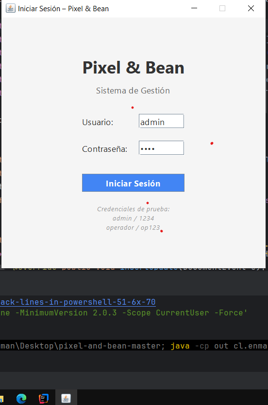
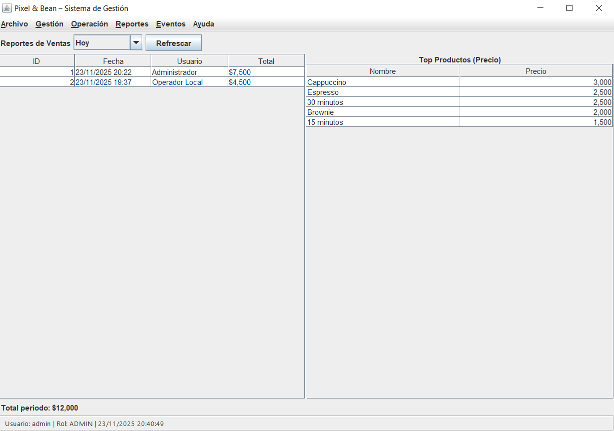
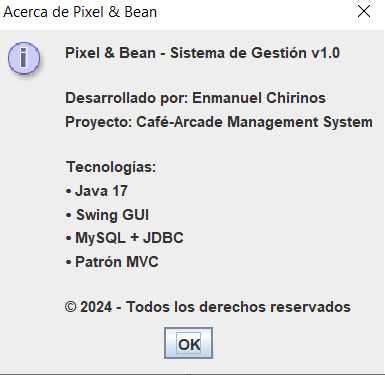

# Generador de Pantallazos - CLASE3 📸

Este documento explica cómo usar el script Python que genera capturas PNG con resaltado de sintaxis Java, un archivo de mapeo y un PDF consolidado.

---

## 📋 ¿Qué hace el script?

El script `tools/export_code_images.py` realiza las siguientes tareas automáticamente:

1. **Lee 13 archivos Java** desde `src/cl/enmanuelchirinos/pnb/`:
   - IUsuarioRepository.java
   - IProductoRepository.java
   - IVentaRepository.java
   - UsuarioRepositoryMock.java
   - ProductoRepositoryMock.java
   - VentaRepositoryMock.java
   - UsuarioService.java
   - ProductoService.java
   - VentaService.java
   - UsuarioController.java
   - ProductoController.java
   - VentaController.java
   - ApplicationContext.java

2. **Aplica resaltado de sintaxis Java** usando Pygments con:
   - Números de línea
   - Estilo amigable "friendly"
   - Fuente monoespaciada DejaVu Sans Mono

3. **Exporta cada archivo como imagen PNG** con nombres ordenados:
   - `01_IUsuarioRepository.png`
   - `02_IProductoRepository.png`
   - ... hasta `13_ApplicationContext.png`

4. **Genera un archivo `mapping.txt`** que relaciona:
   - Número de orden
   - Nombre del archivo fuente
   - Nombre de la captura PNG

5. **Crea un PDF `CLASE3_PANTALLAZOS.pdf`** con todas las imágenes en orden, cada una en una página A4.

---

## 🚀 Ejecución Rápida

### Opción 1: Script PowerShell (más fácil)

Ejecuta desde la raíz del proyecto:

```powershell
powershell -ExecutionPolicy Bypass -File "tools\generar_pantallazos.ps1"
```

O simplemente haz doble clic en `tools\generar_pantallazos.ps1` (si tienes permisos de ejecución).

### Opción 2: Script Python directo

Desde la raíz del proyecto:

```powershell
python tools/export_code_images.py
```

Con rutas personalizadas:

```powershell
python tools/export_code_images.py --src "ruta/a/archivos/java" --out "ruta/salida"
```

---

## 📦 Requisitos Previos

### 1. Python 3.8 o superior

Verifica tu versión:
```powershell
python --version
```

### 2. Librerías necesarias

Instala las dependencias (solo una vez):

```powershell
pip install Pillow reportlab pygments
```

O actualiza pip primero:

```powershell
python -m pip install --upgrade pip
pip install Pillow reportlab pygments
```

---

## 📁 Estructura de Archivos

### Archivos creados:

```
pixel-and-bean-master/
├── tools/
│   ├── export_code_images.py          # Script principal
│   └── generar_pantallazos.ps1        # Lanzador PowerShell
│
└── docs/entregas/CLASE3-EVIDENCIAS/
    ├── screens/                        # Carpeta con las 13 imágenes PNG
    │   ├── 01_IUsuarioRepository.png
    │   ├── 02_IProductoRepository.png
    │   ├── ...
    │   └── 13_ApplicationContext.png
    │
    ├── mapping.txt                     # Mapeo número-archivo-captura
    └── CLASE3_PANTALLAZOS.pdf          # PDF con todas las imágenes
```

---

## 🎯 Salidas Generadas

### 1. Imágenes PNG (`docs/entregas/CLASE3-EVIDENCIAS/screens/`)

Cada archivo Java se convierte en una imagen PNG con:
- Resaltado de sintaxis
- Números de línea
- Fondo claro con código legible

**Nombres**: `01_NombreArchivo.png` a `13_NombreArchivo.png`

### 2. Archivo `mapping.txt`

Formato:
```
01	IUsuarioRepository.java	01_IUsuarioRepository.png
02	IProductoRepository.java	02_IProductoRepository.png
...
13	ApplicationContext.java	13_ApplicationContext.png
```

### 3. PDF `CLASE3_PANTALLAZOS.pdf`

- Cada imagen en una página A4
- Imágenes centradas y escaladas proporcionalmente
- Orden según el checklist original

---

## ⚙️ Parámetros del Script

El script acepta argumentos opcionales:

```powershell
python tools/export_code_images.py --src <carpeta_fuente> --out <carpeta_salida>
```

**Parámetros:**

- `--src`: Carpeta con los archivos `.java` 
  - Por defecto: `src/cl/enmanuelchirinos/pnb`
  
- `--out`: Carpeta base de salida
  - Por defecto: `docs/entregas/CLASE3-EVIDENCIAS`

**Ejemplo:**

```powershell
python tools/export_code_images.py --src "C:\MiProyecto\src\java" --out "C:\Salida\CLASE3"
```

---

## 🛠️ Manejo de Errores

### Si falta un archivo Java:

El script crea una imagen informativa gris con el mensaje:
```
Archivo no encontrado: ruta/archivo.java
Se esperaba para índice XX (NombreArchivo.java)
```

### Si falla el renderizado con Pygments:

Crea una imagen rosa con el mensaje de error específico.

### Archivos no afectados:

Si hay un error en un archivo, el script **continúa** con los demás archivos y genera el PDF con todas las capturas disponibles.

---

## 🎨 Personalización

### Cambiar estilo de resaltado:

Edita `tools/export_code_images.py`, línea ~90:

```python
formatter = ImageFormatter(
    style='friendly',  # Opciones: 'monokai', 'vim', 'default', etc.
    font_size=14,      # Tamaño de fuente
    ...
)
```

Estilos disponibles: https://pygments.org/styles/

### Cambiar tamaño de imagen:

Si las imágenes informativas son muy grandes/pequeñas, edita línea ~190:

```python
img = Image.new('RGB', (1280, 720), color=(245, 245, 245))
```

---

## 📞 Solución de Problemas

### Error: "No se encuentra python"

Asegúrate de tener Python instalado y en el PATH del sistema:
```powershell
python --version
```

Si no funciona, usa la ruta completa:
```powershell
C:\Users\TU_USUARIO\AppData\Local\Programs\Python\Python3XX\python.exe tools/export_code_images.py
```

### Error: "ModuleNotFoundError: No module named 'PIL'"

Instala las dependencias:
```powershell
pip install Pillow reportlab pygments
```

### Error: "can't open file"

Verifica que estés ejecutando el script desde la **raíz del proyecto** `pixel-and-bean-master`:

```powershell
cd "C:\Users\enman\Documents\POO_Duoc\2 semestre\pixel-and-bean-master"
python tools/export_code_images.py
```

### Las imágenes se ven cortadas en el PDF

El script escala automáticamente para A4. Si el código es muy largo, considera:
- Usar tamaño de fuente más pequeño (edita `font_size=14` a un valor menor)
- Dividir archivos largos en múltiples capturas

---

## 📝 Resumen de Comandos

```powershell
# 1. Instalar dependencias (solo primera vez)
pip install Pillow reportlab pygments

# 2. Generar pantallazos (opción PowerShell)
powershell -ExecutionPolicy Bypass -File "tools\generar_pantallazos.ps1"

# 3. Generar pantallazos (opción Python)
python tools/export_code_images.py

# 4. Ver resultados
# PNGs en: docs/entregas/CLASE3-EVIDENCIAS/screens/
# Mapping: docs/entregas/CLASE3-EVIDENCIAS/mapping.txt
# PDF:     docs/entregas/CLASE3-EVIDENCIAS/CLASE3_PANTALLAZOS.pdf
```

---

## ✅ Checklist de Verificación

Después de ejecutar el script, verifica:

- [ ] Se crearon 13 archivos PNG en `docs/entregas/CLASE3-EVIDENCIAS/screens/`
- [ ] Existe el archivo `mapping.txt` con 13 líneas
- [ ] Existe el PDF `CLASE3_PANTALLAZOS.pdf`
- [ ] El PDF tiene 13 páginas (una por archivo)
- [ ] Las imágenes tienen resaltado de sintaxis y números de línea
- [ ] El mapping relaciona correctamente número-archivo-captura

---

## 📚 Archivos del Proyecto

- **`tools/export_code_images.py`**: Script principal en Python
- **`tools/generar_pantallazos.ps1`**: Lanzador PowerShell para Windows
- **`README_CLASE3.md`**: Este archivo de instrucciones

---

¡Listo! 🎉 Ahora puedes generar los pantallazos con un solo comando.

# Pixel & Bean – Entrega Clase 2 (Versión Alpha UI)

## 0. Descripción general breve
Pixel & Bean es un prototipo de sistema de gestión para un café-arcade. Incluye login con roles, administración de usuarios y productos, registro de ventas y reportes básicos. Todo funciona con datos en memoria (servicios stub) sin base de datos aún.

## Futuro (funcionalidad prevista)
Próximas versiones agregarán: arquitectura MVC completa, persistencia JDBC/MySQL, inventario y stock, promociones/eventos, reportes avanzados, más roles y validaciones en capa de servicio.

## Prompt Jumpstart (para crear nuevo repositorio con Copilot)
Generar proyecto Java 17 "pixel-and-bean" (Swing) con paquetes: model, service, controller, gui. Entidades: Usuario, Producto, ItemVenta, Venta. Servicios stub CRUD en memoria. Controladores separados de vistas. MainFrame con CardLayout y paneles: Login, Usuarios, Productos, Ventas, Reportes (Hoy/Ayer/Semana/Mes), Eventos (placeholder), AcercaDe. Incluir build.xml (Ant) con targets compile/run/clean/dist, README con uso y credenciales, .gitignore para out/ y dist/, y pruebas JUnit básicas de servicios.

## 1. Objetivo
Esta entrega muestra la primera versión completa de la interfaz (Alpha UI) de un sistema de gestión para un café-arcade. No usa base de datos todavía. Todos los datos se manejan en memoria mediante "servicios stub" (clases que simulan datos reales).

## 2. ¿Qué se hizo en esta entrega?
Se construyeron todas las pantallas principales y se conectaron mediante un menú y un sistema de navegación con `CardLayout`.

Pantallas incluidas:
1. Login
2. Ventana principal (menú + pantalla de bienvenida)
3. Usuarios (listar, buscar, crear, editar, eliminar, activar/desactivar)
4. Productos (listar, filtrar, crear, editar, eliminar, activar/desactivar, tipo dinámico según categoría)
5. Ventas (agregar productos con cantidad, ver detalle, total, confirmar, anular)
6. Reportes (filtrar ventas por periodos: Hoy, Ayer, Semana, Mes + top productos por precio)
7. Eventos (placeholder: pantalla informativa para futuras funciones)
8. Acerca de (diálogo con información básica)

## 3. Entregables de la Clase 2
1. Código fuente con todas las vistas y lógica stub.
2. Documento de evidencias: `docs/entregas/CLASE2-EVIDENCIAS.md`.
3. Capturas de ejecución (una por vista/funcionalidad) en `docs/entregas/images/screenshots/`.

## 4. Cómo ejecutar
Necesitas tener Java instalado (Java 17 o compatible). 

Pasos:
```powershell
cd C:\Users\enman\Desktop\pixel-and-bean-master
javac -d out (Get-ChildItem -Recurse -Filter *.java).FullName
java -cp out cl.enmanuelchirinos.pnb.PixelAndBean
```
Se abrirá la ventana de Login.

Credenciales de prueba:
| Usuario  | Contraseña | Rol      |
|----------|------------|----------|
| admin    | 1234       | ADMIN    |
| operador | op123      | OPERADOR |

## 5. Flujo básico de uso
1. Iniciar sesión como `admin / 1234`.
2. Explorar el menú superior para cambiar entre vistas.
3. En Usuarios: agregar un usuario nuevo, luego buscarlo usando el campo Buscar.
4. En Productos: cambiar la categoría y observar cómo el campo Tipo se actualiza (dinámico).
5. En Ventas: seleccionar productos y agregarlos con una cantidad > 1; confirmar la venta.
6. En Reportes: cambiar el periodo (Hoy, Semana) y ver el total del rango y el top productos.
7. Revisar el diálogo Acerca de.
8. Salir usando Archivo > Salir.

## 6. Capturas de pantalla
Las imágenes están en: `docs/entregas/images/screenshots/`

| Archivo | Descripción |
|---------|-------------|
| inicio.png | Pantalla de Login |
| menu.png | Pantalla principal / bienvenida tras iniciar sesión |
| operadores.png | Vista Usuarios (listado + formulario) |
| productos.png | Vista Productos (filtro y formulario) |
| ventas.png | Vista Ventas (lista ventas + productos + detalle) |
| ventas_dia.png | Vista Reportes (periodo y top productos) |
| torneo.png | Vista Eventos (placeholder) |
| ayuda.png | Diálogo Acerca de |

### Referencias







## 7. Arquitectura sencilla (por ahora)
- `MainFrame` contiene un panel central con `CardLayout`. Cada vista (panel) se agrega con un nombre.
- El menú llama a métodos para mostrar la vista correcta: `cardLayout.show(...)`.
- No hay conexión a base de datos: los datos se guardan en listas dentro de clases stub.
- Cada panel tiene su propio `TableModel` para mostrar listas (por ejemplo, productos y usuarios).
- Ventas usa una lista de `ItemVenta` para calcular el subtotal y el total dinámico.

## 8. Estructura de carpetas explicada
```
src/cl/enmanuelchirinos/pnb/
├── PixelAndBean.java          # Punto de entrada
├── gui/
│   ├── LoginFrame.java        # Ventana inicial (login)
│   ├── MainFrame.java         # Ventana principal y menú
│   └── panels/                # Cada vista del sistema
│       ├── UsuariosPanel.java
│       ├── ProductosPanel.java
│       ├── VentasPanel.java
│       ├── ReportesPanel.java
│       └── EventosPanel.java
├── model/                     # Clases de datos
│   ├── Usuario.java
│   ├── Producto.java
│   ├── Venta.java
│   └── ItemVenta.java
└── service/                   # Interfaces y stubs
    ├── UsuarioService.java
    ├── ProductoService.java
    ├── VentaService.java
    └── impl/ (implementaciones simuladas)
```

## 9. Qué es un "servicio stub"
Es una clase que actúa como si fuera el acceso real a datos, pero sólo usa listas en memoria. Sirve para desarrollar la interfaz sin esperar la base de datos. Ejemplo: `ProductoServiceStub` retorna una lista fija de productos iniciales.

## 10. Validaciones incluidas
- Campos obligatorios (por ejemplo, nombre en productos y usuarios)
- Precio mayor a 0 en productos
- Cantidad mayor o igual a 1 en ventas

## 11. Checklist de lo logrado (Clase 2)
Funcionalidad:
- [x] Login y roles
- [x] Navegación entre vistas
- [x] Usuarios CRUD en memoria
- [x] Productos CRUD en memoria + filtro + tipo dinámico
- [x] Ventas con detalle, subtotal y total
- [x] Reportes por periodo + top productos
- [x] Eventos placeholder
- [x] Diálogo Acerca de

Técnico:
- [x] CardLayout para cambiar pantallas
- [x] TableModels personalizados
- [x] Renderers para formato
- [x] Búsqueda incremental (DocumentListener)
- [x] Uso de objetos de dominio (Usuario, Producto, Venta, ItemVenta)

Código:
- [x] Estructura clara de paquetes
- [x] Compila sin errores
- [x] Capturas organizadas

## 12. Próximo paso (Clase 3)
Refactor del código a un esquema MVC real:
- Separar lógica de la interfaz
- Crear controladores por pantalla
- Crear capa de repositorios y preparar conexión a base de datos (JDBC)
- Mover validaciones de negocio a servicios

## 13. Glosario rápido
| Término | Explicación breve |
|---------|-------------------|
| Stub | Implementación falsa para simular datos reales |
| CardLayout | Layout que muestra un panel a la vez por nombre |
| TableModel | Clase que define cómo mostrar datos en una JTable |
| Render | Código que cambia cómo se ve una celda de la tabla |
| MVC | Separar Modelo (datos), Vista (pantallas), Controlador (lógica) |

## 14. Nota final
Esta versión es para aprender a construir interfaces y manejar eventos. No guarda nada de forma permanente. Los datos se reinician cada vez que inicias la aplicación.

## 15. Cómo hacer el commit y subir a GitHub
Si aún no has creado un repositorio en GitHub:
1. Entra a https://github.com y crea un repositorio nuevo (sin README inicial). Ejemplo nombre: `pixel-and-bean`.
2. Abre PowerShell en la carpeta del proyecto:
   - Clic derecho en la carpeta `pixel-and-bean-master` > "Abrir en Terminal".
3. Ejecuta estos comandos:
```powershell
git init
git add .
git commit -m "Clase 2: Alpha UI completa"
```
4. Obtén el hash del commit:
```powershell
git log -1 --pretty=format:%H
```
5. Conecta al repositorio remoto (reemplaza TU_USUARIO):
```powershell
git branch -M main
git remote add origin https://github.com/TU_USUARIO/pixel-and-bean.git
git push -u origin main
```

### Hash del commit de la Entrega 2
`5acdb04a4717b43affd4042d14c81b04bc1404cf`

Si el repositorio ya existe y sólo actualizas:
```powershell
git add .
git commit -m "Actualizacion evidencias Clase 2"
git push
```

---
Entrega Clase 2 – Pixel & Bean. Preparado para continuar con MVC y base de datos en la siguiente etapa.
